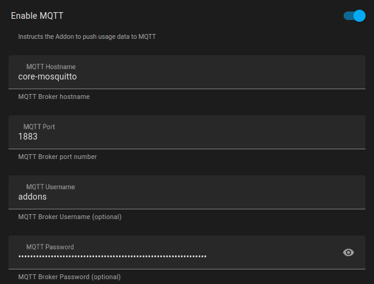
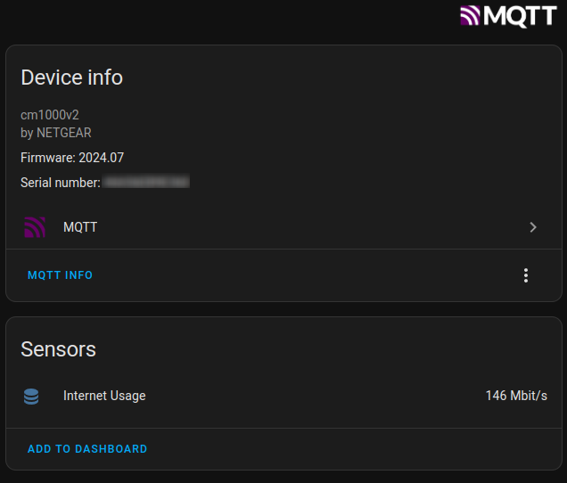
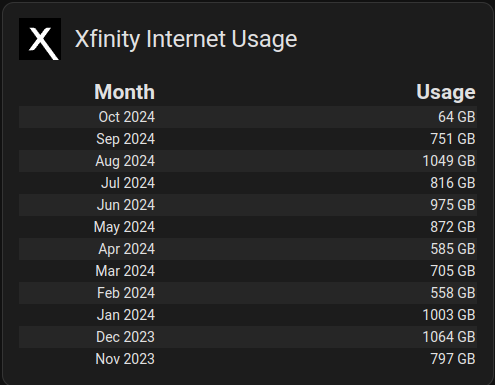

## MQTT Guide:
- [MQTT Setup](#mqtt-setup)
- [MQTT Raw Usage Sensor](#mqtt-raw-usage-sensor)
  - [MQTT Raw Usage Dashboard](#mqtt-raw-usage-dashboard)
- [MQTT Advanced Dashboard with Node-RED](#mqtt-advanced-dashboard-with-node-red)


## MQTT Setup

Enable MQTT and enter the MQTT Broker information and login if necessary. Note if you are using the Moquitto MQTT addon, the addon will attempt to use the settings provided by the Moquitto MQTT addon. The Addon startup logs will show the necessary MQTT broker info like below. There is also a option now to publish the raw Xfinity usage data to the MQTT topic 'xfinity'

```text
---
MQTT addon is active on your system!
Add the MQTT details below to the addon configuration :
MQTT user : addons
MQTT password : Ri5ahV1aipeiw0aelerooteixai5ohtoeNg6oo3mo0thi5te0phiezuge4Phoore
MQTT Hostname : core-mosquitto
MQTT Port : 1883
---
```



Then check your MQTT Devices



## MQTT Raw Usage Sensor

If you enable the Raw Usage MQTT topic, you can create a new template sensor using the configuration below.

```yaml
- trigger:
    - platform: mqtt
      topic: "xfinity"
      id: xfinity
  sensor:
    - unique_id: 3a6de002-4cbe-4d98-a6eb-75f6f4d8d082
      name: Xfinity Raw Usage
      state: >
          {{ now() }}
      attributes:
        usage_months: >
          {{ trigger.payload_json.usageMonths }}
```

## MQTT Raw Usage Dashboard

Create a new HA Lovelace card using the Markdown Card

```yaml
Month|Usage
:---|---:	



    
    {{ strptime(usage.startDate,'%m/%d/%Y') | as_timestamp | timestamp_custom("%b %Y") }} | {{ usage.totalUsage }} GB 


```

Control card layout using [card-mod 3](https://github.com/thomasloven/lovelace-card-mod)

```yaml
card_mod:
  style:
    ha-markdown$: |
      table {
        border-collapse: collapse;
        width: 100%;
      }
      th {
        font-size: 1.5em;
        line-height: 1.2em;
      }
      th:first-child {
        text-align: right;
        width: 30%;
      }
      tbody > tr:nth-child(odd) {
        background: #262626;
      }
    $: |
      .card-header {
        display: flex !important;
        align-items: center;
      }
      .card-header:before {
          content: url("data:image/svg+xml,%3Csvg xmlns='http://www.w3.org/2000/svg' version='1' width='42' height='42' viewBox='0 0 700 700'%3E%3Cpath fill='%23000' d='M0 350v350h571l-9-12.3c-5-6.7-53.7-73.9-108.3-149.4-54.5-75.5-99.5-137.1-99.9-137-.4.1-19.9 25.6-43.3 56.7-45.5 60.5-52.1 68.1-63.7 73.8-12 5.9-16 6.4-52 6.9-18.1.3-32.8.2-32.8-.1 0-.3 32.6-44.5 72.5-98.3 39.8-53.8 72.4-98.1 72.2-98.5-.1-.4-29.4-40.4-65.2-88.9-35.7-48.5-65.4-88.8-65.8-89.6-.8-1.2 3.8-1.4 35.5-1.1 34.8.4 36.6.5 42.8 2.7 9.2 3.2 16.5 8 23.7 15.3 3.4 3.5 21.8 27.9 40.8 54.3 19 26.4 34.9 48.1 35.3 48.2.4.1 16.9-21.6 36.7-48.4 19.8-26.7 38.6-51.2 41.8-54.4 6.8-6.8 14.7-11.8 23.7-15 6.2-2.2 8-2.3 42.9-2.7 29.8-.3 36.2-.1 35.5 1-.5.7-30.5 41-66.7 89.6-36.2 48.6-65.7 88.9-65.5 89.7.2.7 59 81.4 130.8 179.4l130.5 178 18.3.1H700V0H0v350z'/%3E%3C/svg%3E");
          height: 42px;
          width: 42px;
          margin-top: 0px;
          padding-left: 0px;
          padding-right: 0px;
          margin-right: 14px;
          background: #FFF;
      }

```

You should now have a dashboard card that looks similar to this:



## MQTT Advanced Dashboard with Node-RED

[Xfinity Usage Monitoring](https://zachowj.github.io/node-red-contrib-home-assistant-websocket/cookbook/xfinity/#xfinity-usage-monitoring) setup using Node-RED. The cookbook will walk you through how to create a dashboard like below. Thanks [zachowj](https://github.com/zachowj) for sharing this.

